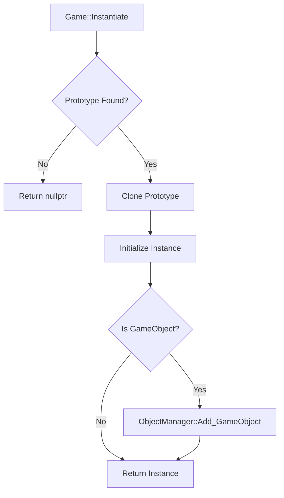
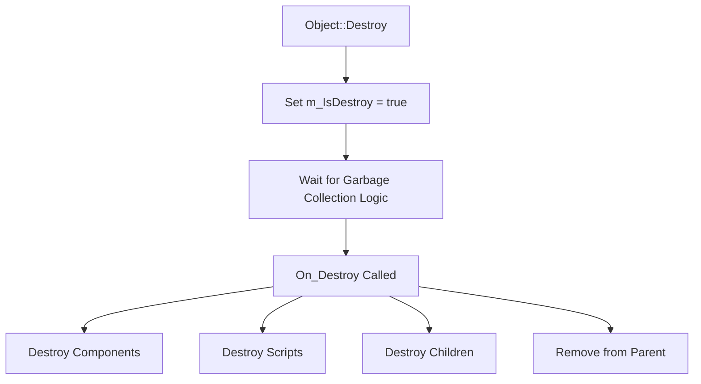

# 엔진 오브젝트 라이프사이클 및 워크플로우 (For Draw.io)

Draw.io에서 다이어그램을 작성할 때 참고할 수 있는 워크플로우 명세입니다.

---

## 1. 오브젝트 생성 (Creation)
**진입점**: `Game::Instantiate<T>(arg)`

1.  **Level Manager 확인**: 현재 레벨 인덱스를 가져옵니다.
2.  **Prototype Manager 검색**:
    *   요청된 타입(T)의 이름/ID로 프로토타입 원본을 찾습니다.
    *   없을 경우 에러 리턴.
3.  **복제 (Clone)**:
    *   프로토타입 객체의 `Clone(arg)` 메서드 호출.
    *   (내부동작) 새 인스턴스 메모리 할당.
    *   (내부동작) `Initialize(arg)` 호출:
        *   고유 ID (`OBJECT_ID_UNIQUE`) 생성.
        *   컴포넌트/스크립트 초기화 로직 수행.
4.  **등록 (Registration) - GameObject인 경우**:
    *   `ObjectManager::Add_GameObject(newObject)` 호출.
    *   오브젝트 매니저의 관리 컨테이너(Layer 등)에 추가됨.
5.  **반환**: 생성된 객체의 `Shared<T>` 포인터 반환.

---

## 2. 오브젝트 활성화 (Activation)
**진입점**: `Object::Set_Active(true)`

1.  **상태 체크**: 이미 활성화 상태(`m_IsActive == true`)라면 즉시 종료.
2.  **활성 로직 수행 (`On_Enable`)**:
    *   **자신**: `m_IsActive = true` 설정.
    *   **컴포넌트 (`m_Components`)**: 모든 보유 컴포넌트의 `Set_Active(true)` 재귀 호출.
    *   **스크립트 (`m_Scripts`)**: 모든 스크립트의 `Set_Active(true)` 재귀 호출.
    *   **자식 객체 (`m_Children`)**: 모든 자식 오브젝트의 `Set_Active(true)` 재귀 호출.
    *   **트랜스폼 (`m_Transform`)**: 트랜스폼 컴포넌트 활성화.

---

## 3. 오브젝트 비활성화 (Deactivation)
**진입점**: `Object::Set_Active(false)`

1.  **상태 체크**: 이미 비활성 상태(`m_IsActive == false`)라면 즉시 종료.
2.  **비활성 로직 수행 (`On_Disable`)**:
    *   **자신**: `m_IsActive = false` 설정.
    *   **컴포넌트**: 모든 컴포넌트 비활성화.
    *   **자식 객체**: 모든 자식 오브젝트 비활성화.

---

## 4. 오브젝트 파괴 (Destruction)
**진입점**: `Object::Destroy(object)`

1.  **플래그 설정**: 대상 객체의 `m_IsDestroy = true` 설정.
2.  **게임 루프 처리 (ObjectManager/LevelManager)**:
    *   업데이트 루프 마지막(혹은 시작)에 `Is_Destroy()`가 true인 객체들을 수집.
3.  **자원 해제 (`On_Destroy` 호출)**:
    *   **컴포넌트 해제**: `m_Components`, `m_Scripts` 순회하며 `Destroy()` 호출 및 컨테이너 Clear.
    *   **자식 해제**: `m_Children` 순회하며 `Destroy()` 호출 및 컨테이너 Clear.
    *   **부모 연결 해제**: 부모가 있다면 부모의 `Remove_Child(this)` 호출.
    *   `m_Parent` 포인터 초기화.
    *   `m_Transform` 파괴.

---

## 5. 부모/자식 관계 설정 (Relations)
*(참고: 현재 코드상으로는 구현이 비어있으나, 일반적인 엔진 로직을 기반으로 정의합니다)*

**진입점**: `GameObject::Set_Parent(newParent)`

1.  **유효성 검사**: `newParent`가 `null`이거나 자기 자신인 경우 처리.
2.  **기존 부모 해제 (`Remove_Parent`)**:
    *   기존 부모(`m_Parent`)가 있다면, 기존 부모의 자식 목록에서 자신을 제거(`Remove_Child`).
3.  **새 부모 설정**:
    *   `m_Parent = newParent` (Weak Pointer로 참조).
    *   새 부모의 자식 목록에 자신을 추가 (`newParent->Add_Child(this)`).
4.  **트랜스폼 갱신**:
    *   자신의 로컬 좌표를 유지할지, 월드 좌표를 유지할지에 따라 `Transform` 행렬 재계산.

---

## 6. 컴포넌트 등록 (Component Registration)
**진입점**: `GameObject::Add_Component<T>(arg)`

1.  **유효성 검사**: Reflection(`rttr`)을 통해 타입 정보 확인.
2.  **인스턴스 생성 (`Game::Instantiate<T>`)**:
    *   해당 컴포넌트의 프로토타입을 찾아 복제(Clone).
    *   `Initialize(arg)` 수행.
3.  **컨테이너 추가**:
    *   **스크립트인 경우**: `m_Scripts` 맵에 `ObjectID`를 키로 추가.
    *   **일반 컴포넌트인 경우**: `m_Components` 맵에 `ComponentType`을 키로 추가.
4.  **반환**: 생성된 컴포넌트의 포인터 반환.
